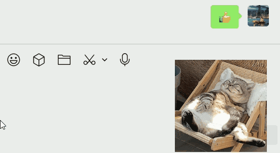

# 浮图 - 一张浮图，半刻治愈


一款极简的桌面减压图片置顶小组件，不妨碍你的鼠标操作。

设计初衷是我每次上班电脑用久了，难免压力水平上升，如果一转眼能看到一张减压图，能让我分泌多巴胺，降低皮质醇，放松心情，但是如果一直置顶，难免会影响鼠标操作，所以开发了这个小工具。

## 特性

- 轻量级单文件可执行程序，无需安装
- 鼠标靠近时会变小透明，隐藏自身，不影响你的操作
  

编辑模式：

1. 每次打开应用都会进入编辑模式
2. 编辑模式可以缩放窗口大小，拖拽窗口位置

常态模式：

1. 双击托盘图标可进入，再次双击可退出
2. 无法对窗口做任何修改
3. 鼠标靠近窗口就会变透明
4. 隐藏任务栏按钮

### 配置存储

存储在 C:\Users\<用户名>\AppData\Roaming\fyne\com.futu.desktop

### todo

1. [done]真正无边框桌面贴纸效果
2. [done]不显示任务栏图标
3. [done]拖拽移动
4. [done]置顶
5. [done]鼠标滚动缩放，且缩放的中心点为鼠标所在的位置。
6. [done]导入图片后，窗口宽度保持不变，高度调整成跟图片一样，调整高度时，缩放中心点为图片中心点。
7. [done]点击穿透
8. [done]设置界面，可以设置开机自启
9.  播放器 goroutine 安全退出（防泄漏）
10. 写一个CI 跨平台自动编译脚本，dist 目录一键打包，自动发布 bat（含 git tag）
11. 拖拽文件到浮图直接播放（这个要设置开关）
12. 右键托盘 → 最近 5 个 GIF
13. [done]现在打包不会把图标打包进去，把打包后的exe挪个位置，就找不到图标了。
14. [done]启动应用记住上次打开的图片
15. [done]双击系统盘图标切换编辑模式与常态，常态下不可拖拽
16. [done]研究下fyne的打包会不会比我现在的更好：https://docs.fyne.io/started/packaging/
17. [done]每次启动app，都记住上一次的缩放和位置，如果位置超过屏幕显示范围，则放到屏幕中间
18. codex把代码里的中文注释都认为是乱码，然后删除，看看能不能让它读懂中文注释【是个已知bug，等修吧】
19. [done]差不多要开始搞测试用例了，ai改的代码如果不想仔细看的话，后面功能多起来，就容易改出bug
20. [done]托盘菜单中增加一个“关于”的菜单，点击进去后显示软件版本、作者、许可证、操作指南
21. 做“自适应 tick”，（已经让AI做过了，发现鼠标快速接近窗口时透明度降低得慢，像卡了的样子，就先取消了，如果后续有人说资源占用高，再加这个功能吧）：
    近距离（鼠标贴近/接触窗口）：16ms 高频刷新
    远距离（>=200px）：220ms 低频刷新
    鼠标静止不动：350ms 更低频（idle）
22. [done]做个快捷键功能，
    1.  快速切换编辑模式
    2.  快速隐藏窗口
23. [done]每次切换编辑模式和常态模式时，窗口上出现文字提示当前状态
24. [done]允许用户设置鼠标远离时透明度
25. 可以选择文件夹，每小时会从文件夹内随机选择图片显示（待思考这个特性跟选择一张图片之间怎么兼容。）
    1.  现在做了一版，待优化，因为codex这周的额度用完了。
26. 图片缩放最大最小的限制改为根据像素，最小不小于10px，最大不大于屏幕宽度
27. 支持网络图片。用户设置一个源url，这个源url里面每行记录一张图片的url，每小时从里面随机选一张图片显示，每天从该源里更新图片，也可以主动点击更新。每次更新完成后，如果有新增的图片，优先随机这些图，直到新图全部显示过一遍再从全量里面随机。
28. 换图间隔可设置，默认1小时。这个换图间隔

bug：

1. 有时候切换编辑状态无法编辑？

## AI生成提示语

本项目99%的代码由 GPT-5.3-codex 生成

```text
用go的Fyne写一个桌面小组件，可以在电脑桌面上循环播放动图（GIF、WebP），项目名叫浮图，英文叫Futu。要求windows系统免安装即可使用。在系统托盘图标处右键可更换图片。生成一个项目，不要单文件项目。
```

最好每次用AI实现一个小功能后，端到端测试一遍，没问题了就提交代码，再让AI实现下一波代码，方便随时回退到之前的版本。

目前使用AI遇到的问题：

1. 它写需求的函数时可能会把所有函数放到该需求的包里，不会抽离到公用库，当它写新需求时发现函数实现过了，但是在别的需求包里，仍会重新实现一遍放到新的需求包里。
   1. 解决方法：目前只想到人工review，发现它重复造轮子之后要求他抽离出来。
2. 它实现功能时并不一定会按照最优性能来实现，所以要经常要求它优化下性能。
3. 有时候会用一些被弃用的方法，需要多review。

## 性能

已经经过多次优化，目前开销主要在渲染gif动图上，全透明时可以看到cpu占用为0%。

## 构建

### 环境安装

1. 安装fyne：https://docs.fyne.io/started/quick/ （注意，安装后确保PATH变量中，`C:\msys64\mingw64\bin`在`~\go\bin`前面）


### Windows

```bash
.\cmd\build.bat
```

## 使用go原生编译

```bash
go build -ldflags="-s -w -H=windowsgui" -o futu.exe ./main
```

参数说明:
- `-s -w`: 去除调试信息，减小体积
- `-H=windowsgui`: 编译为 GUI 程序，不显示控制台窗口

## 项目结构

```
futu/
├── main.go                # 程序入口
├── app/                   # 核心应用代码
│   ├── app.go             # 应用初始化与主流程
│   ├── settings_window.go # 设置窗口
│   ├── tray.go            # 系统托盘菜单与交互
│   ├── drag/              # 拖拽与交互组件
│   ├── player/            # GIF/WebP 播放实现
│   ├── platform/          # 平台相关能力（如窗口移动）
│   └── utils/             # 通用工具（窗口、资源、文件等）
├── cmd/                   # 构建/运行脚本
├── assets/                # 图标等静态资源
├── docs/                  # 文档与演示资源
├── go.mod
├── go.sum
└── README.md
```

## 技术栈

- **语言**: Go 1.21+
- **GUI**: Fyne v2.7.2
- **GIF 解码**: 标准库 image/gif

ps. fyne在ui上做不了很好看，以后还是考虑用Wails吧，用的是WebView2渲染ui，比较新的win10或以上就会自带。

## 开发

### 调试

```cmd
.\cmd\run.bat
```

### 单元测试

```shell
go test ./... -cover
```

## 许可证

MIT License
